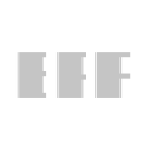

# EProp

**EProp is an ERC721-based property ownership system with its token and marketplace features**

  - Allowing the owner of the token to list and unlist the token for sale 
   - Allowing the owner of the token to set an address as a buyer with a cerain price 
   - Allowing users to make an offer for a token 


# Getting Started

## Requirements

- [git](https://git-scm.com/book/en/v2/Getting-Started-Installing-Git)
  - You'll know you did it right if you can run `git --version` and you see a response like `git version x.x.x`
- [foundry](https://getfoundry.sh/)
  - You'll know you did it right if you can run `forge --version` and you see a response like `forge 0.2.0 (816e00b 2023-03-16T00:05:26.396218Z)`

## Quickstart

```
git clone https://github.com/emtothed/EProp
cd foundry-nft-f23
forge install
forge build
```

# Usage

## Start a local node

```
make anvil
```

## Deploy

This will default to your local node. You need to have it running in another terminal in order for it to deploy.

```
make deploy
```


# Deployment to a testnet or mainnet

1. Setup environment variables

You'll want to set your `SEPOLIA_RPC_URL` and `SEPOLIA_PRIVATE_KEY` as environment variables. You can add them to a `.env` file, similar to what you see in `.env.example`.

- `SEPOLIA_PRIVATE_KEY`: The private key of your account (like from [metamask](https://metamask.io/)). **NOTE:** FOR DEVELOPMENT, PLEASE USE A KEY THAT DOESN'T HAVE ANY REAL FUNDS ASSOCIATED WITH IT.
  - You can [learn how to export it here](https://metamask.zendesk.com/hc/en-us/articles/360015289632-How-to-Export-an-Account-Private-Key).
- `SEPOLIA_RPC_URL`: This is url of the goerli testnet node you're working with. You can get setup with one for free from [Alchemy](https://alchemy.com/?a=673c802981)

Optionally, add your `ETHERSCAN_API_KEY` if you want to verify the contract on [Etherscan](https://etherscan.io/).

1. Get testnet ETH

Head over to [sepoliafaucet.com](https://sepoliafaucet.com/) and get some tesnet ETH. You should see the ETH show up in your metamask.

2. Deploy

```
make sepoliaDeploy
```

## Testing

```
forge test
```

or 

```
forge test --fork-url $SEPOLIA_RPC_URL
```

## Scripts

After deploy to a testnet or local net, you can run the script to mint a token. 
1. change interaction.s.sol and put your private key in the place
```
function mintNftOnContract(address contractaddress) public {
        address yourAddress = -------put your address here---------;
        
        console.log("minting token for: ", yourAddress);
        vm.startBroadcast();
        EProp(contractaddress).mintProp(yourAddress, 65, 45, 1, 1 , 0);
        vm.stopBroadcast();
    }
```

2.
```
make mint
```
or 
```
make sepoliaMint
```

### Email : asadi.code@gmail.com
# Thank you!